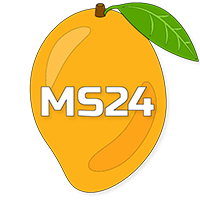

# MangoSynth24 (MS24)

Welcome to the MS24 repository! 🥭

This repo contains the source code for my final year project. 🎓

You can find my thesis in the `Docs` folder [here](Docs/SDM_N00191671_Y4_MangoSynth_Dissertation-FINAL.pdf). 📜

You can find my technical screencast in the `Docs\Video` folder [here](Docs/Video/MS24_TechnicalScreencast_Compressed.mp4). 🎬

You can try out MS24 [here](https://ms24.vercel.app/), where it is hosted through Vercel. 🌐

## 🎹 Features
#### Synth Features
- 2x FM Oscillators
- 1x AM Sub Oscillator
- ADSR Envelopes (per-oscillator)
- Unison Controls (per-oscillator)
- Arpeggiation (per-oscillator, synced to BPM)
- Multi-filter (LP, HP, BP, AP, Notch, LS, HS)
- Low-Frequency Oscillator (LFO)
- 9x FX to choose from:
  - Distortion
  - Chebyshev
  - Phaser
  - Tremolo
  - Vibrato
  - Delay
  - Reverb
  - Pitch Shift
  - Frequency Shift
#### App Features
- Light/Dark Mode
- Preset System (with 16 default presets)
- MIDI Support (including MIDI Learn)
- Audio Recording & Exporting (lossless WAV)
- Oscilloscope Visualizations
- Tooltips

## 🎮 Controls
#### Playing Keys
- **Mouse**: Click on the virtual keyboard to play notes.
- **MIDI Keyboard**: Ensure it's connected before loading the page, then use normally.
- **Computer Keyboard**: The image below shows which keys can be used.

#### Knobs & Sliders
- Click and drag to adjust values.
- You can also scroll with the mouse wheel to adjust values.
- You can also type in values directly.
- Hold ``SHIFT`` while adjusting to fine-tune.
- Hold ``CTRL`` and click to reset to default value.
- Right-click to open the MIDI-learn context menu.

#### Buttons
- Click on the green buttons to toggle major synth components.
- Click on the purple buttons to toggle oscillator arpeggiators.

#### Selectors
- Click on the LFO or FX select boxes to change modulation target or effect type.

## ⚙ Installation
#### Electron App
1. Go to the [Releases](https://github.com/IADT-projects/y4-project-Mangoshi/releases/tag/releases) page.
2. Download the latest release (Windows only for now).
3. Run the installer.
4. Enjoy!
#### Local Hosting
1. Clone the repo.
2. Run `npm install` to install dependencies.
3. Run `npm run dev` to start the dev server.
4. Open `localhost:3000` in your browser.
5. Enjoy!

## 📡 Technologies
- JavaScript (Vanilla)
- HTML
- [TailwindCSS](https://tailwindcss.com/)
- [Vite](https://vitejs.dev/)
- [Tone.js](https://tonejs.github.io/)
- [P5.js](https://p5js.org/)
- [webaudio-controls](https://github.com/g200kg/webaudio-controls)
- [extendable-media-recorder](https://github.com/chrisguttandin/extendable-media-recorder)
- [extendable-media-recorder-wav-encoder](https://github.com/chrisguttandin/extendable-media-recorder-wav-encoder)
- [vite-plugin-top-level-await](https://github.com/Menci/vite-plugin-top-level-await)
- [browser-dtector](https://github.com/sibiraj-s/browser-dtector)
